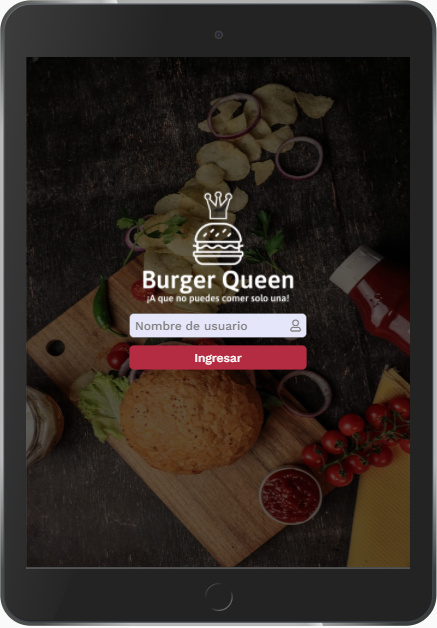
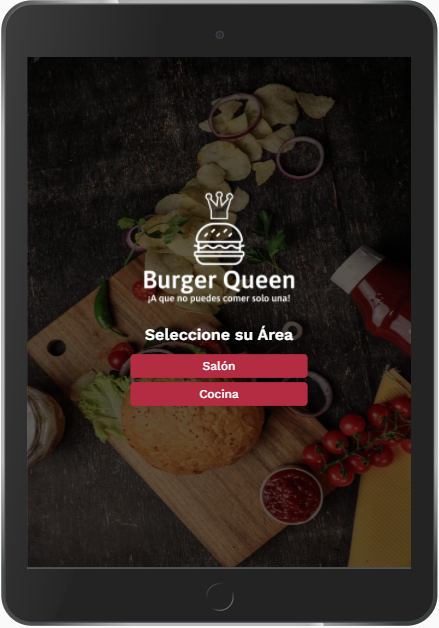
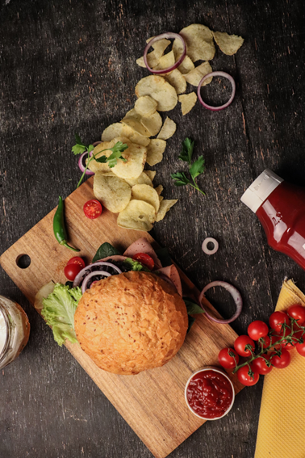

# Burger Queen

## 1. Definición del producto

Burger Queen es un software diseñado para un restaurante de hamburguesas, que está creciendo, necesita una interfaz en la que puedan tomar pedidos usando una tablet, y enviarlos a la cocina para que se preparen ordenada y eficientemente a través del backend.

El objetivo de este software es facilitar la organización del trabajo dentro del restaurante automatizando los procesos de pedidos que reciben los garzones por parte de los comensales.

## 2. Principales usuarios del producto

Garzones y cocineros que trabajen en el restaurante que cuenten con un usuario válido para poder ingresar correctamente a la interfaz.

## Historia de usuario 1: Mesero/a debe poder tomar pedido de cliente

Yo como meserx quiero tomar el pedido de un cliente para no depender de mi mala memoria, para saber cuánto cobrar, y enviarlo a la cocina para evitar errores y que se puedan ir preparando en orden.

_Criterios de aceptación:_

- 1- Anotar nombre de cliente.
- 2- Agregar productos al pedido.
- 3- Eliminar productos.
- 4- Ver resumen y el total de la compra.
- 5- Enviar pedido a cocina (guardar en alguna base de datos).
- 6- Se ve y funciona bien en una tablet
- 7- Definición de terminado
- 8- Lo acordado que debe ocurrir para decir que la historia está terminada.

_Definición de Terminado (DOD):_

- Debes haber recibido code review de al menos una compañera.
- Haces test unitarios y, además, has testeado tu producto manualmente.
- Hiciste tests de usabilidad e incorporaste el feedback del usuario.
- Desplegaste tu aplicación y has etiquetado tu versión (git tag).

## Historia de usuario 2: Jefe de cocina debe ver los pedidos

Yo como jefx de cocina quiero ver los pedidos de los clientes en orden y marcar cuáles están listos para saber qué se debe cocinar y avisar a lxs meserxs que un pedido está listo para servirlo a un cliente.

_Criterios de aceptación:_

- 1- Ver los pedidos ordenados según se van haciendo.
- 2- Marcar los pedidos que se han preparado y están listos para servirse.
- 3- Ver el tiempo que tomó prepara el pedido desde que llegó hasta que se marcó como completado.

_Definición de Terminado (DOD):_

- Debes haber recibido code review de al menos una compañera.
- Haces test unitarios y, además, has testeado tu producto manualmente.
- Hiciste tests de usabilidad e incorporaste el feedback del usuario.
- Desplegaste tu aplicación y has etiquetado tu versión (git tag).

## Historia de usuario 3: Meserx debe ver pedidos listos para servir

Yo como meserx quiero ver los pedidos que están preparados para entregarlos rápidamente a los clientes que las hicieron.

_Criterios de aceptación:_

- 1- Ver listado de pedido listos para servir.
- 2- Marcar pedidos que han sido entregados.

_Definición de Terminado (DOD):_

- Debes haber recibido code review de al menos una compañera.
- Haces test unitarios y, además, has testeado tu producto manualmente.
- Hiciste tests de usabilidad e incorporaste el feedback del usuario.
- Desplegaste tu aplicación y has etiquetado tu versión (git tag).
- Los datos se deben mantener íntegros, incluso después de que un pedido ha terminado. Todo esto para poder tener estadísticas en el futuro.

## Proceso de Prototipado

### Prototipo de baja fidelidad

(Invision)

### Prototipo de alta fidelidad

(Figma)

### Iteraciones de prototipo según feedback recibido

(Figma)

### LOGO

La inspiración del logo para este proyecto surgió del mismo nombre. Decidimos colocarle a la imagen de hamburguesa una corona para hacerlo aún mas representativo usando colores fríos en tono blanco para se destacara y no generara distracción alguna con respecto a los demás elementos (para efectos de visualización en este archivo se anexa el logo en tonos grises).

### Background

Nos inclinamos por una paleta de colores fríos que le otorgaron sobriedad y elegancia a nuestro diseño.

## Recursos (enlaces)

- Prototipo baja fidelidad ([Invision](https://ladypino607202.invisionapp.com/freehand/Burger-Queen--ga1h5kkHn))
- Prototipo alta fidelidad ([Figma](https://www.figma.com/file/XU90OrgJNEPfTOs2pcFyrr/Burger-Queen?node-id=5%3A24))
- Prototipo navegable ([Navegable](https://www.figma.com/proto/XU90OrgJNEPfTOs2pcFyrr/Burger-Queen?node-id=252%3A487&scaling=scale-down))
- Organización ([Trello](https://trello.com/b/erh1XEIn/burger-queen))

## Desarrolladoras

- [Yndira Natera](https://github.com/naterayc/)
- [Lady Pino](https://github.com/Ladypino/)
- [Daniela Blanco](https://github.com/danielablancom/)
